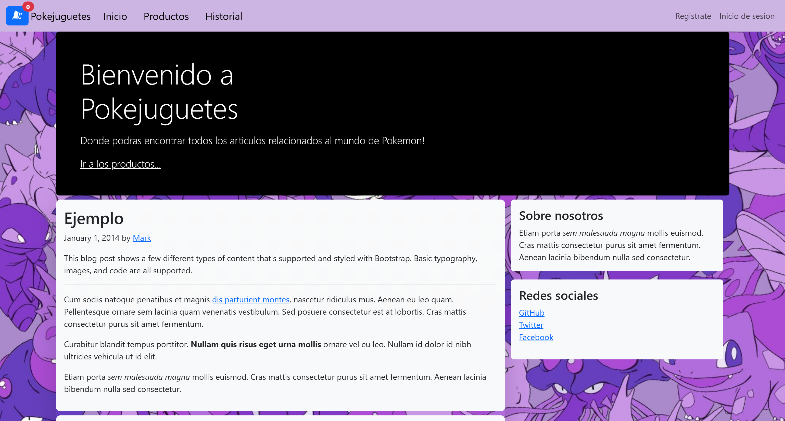
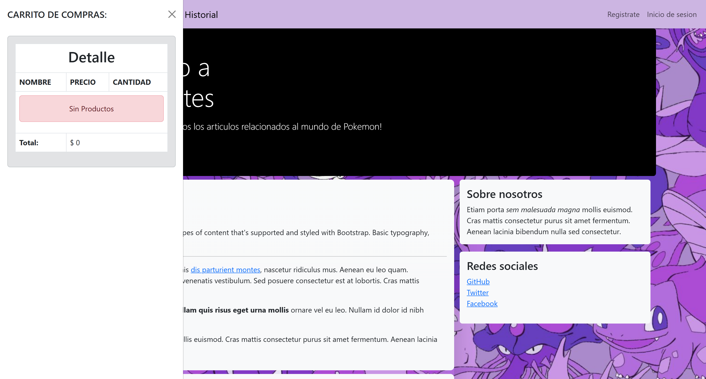
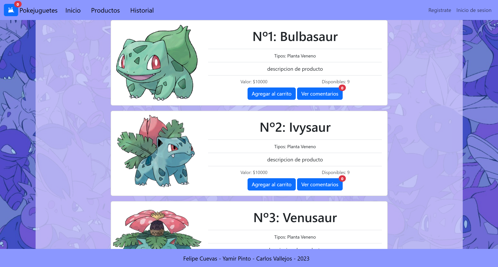
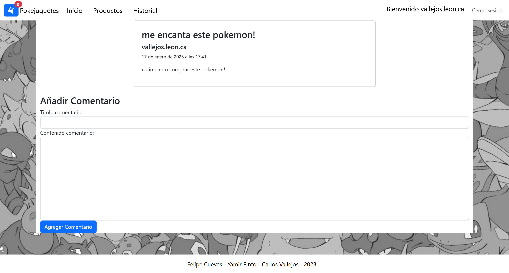
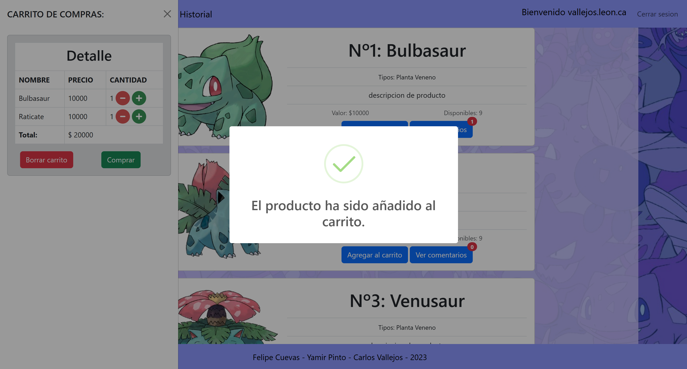
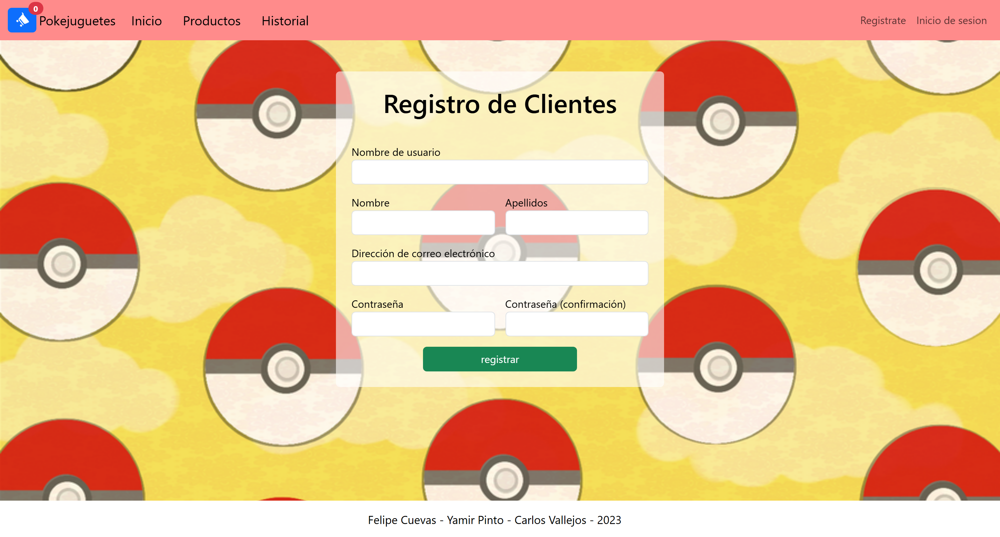
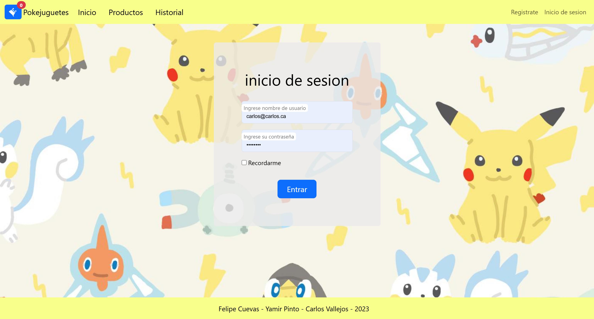
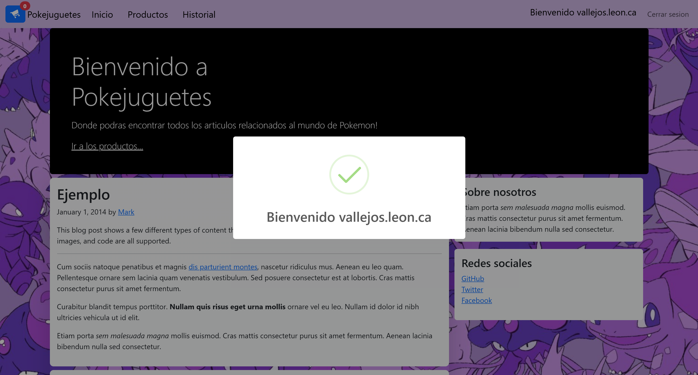

# PokeJuguetes

PokeJuguetes es una aplicación web desarrollada con Django que permite a los usuarios comprar productos relacionados con Pokémon, agregar comentarios y gestionar su carrito de compras.

---

## 📄 Descripción General

El objetivo del proyecto es proporcionar una plataforma donde los fanáticos de Pokémon puedan adquirir productos, dejar comentarios y gestionar sus compras de manera sencilla y eficiente.

---

## 📕 Características

### 📃 Estructura del Proyecto

```plaintext
PokeJuguetes/
├── db.sqlite3
├── dependencias.txt
├── files_pkm/
│   └── fotos_pkm/
├── m_carrito/
│   ├── __init__.py
│   ├── admin.py
│   ├── apps.py
│   ├── context_processor.py
│   ├── migrations/
│   ├── models.py
│   ├── tests.py
│   ├── urls.py
│   └── views.py
├── m_comentario/
│   ├── __init__.py
│   ├── admin.py
│   ├── apps.py
│   ├── formulario.py
│   ├── migrations/
│   ├── models.py
│   ├── tests.py
│   ├── urls.py
│   └── views.py
├── m_enviocorreo/
│   ├── __init__.py
│   ├── admin.py
│   ├── apps.py
│   └── envio_correo.py
├── m_productos/
├── m_usuarios/
├── m_venta/
├── manage.py
├── Poke_Juguetes/
├── pokemonsMYSQL.sql
├── README.md
└── recursos/
    ├── css/
    └── js/
    └── vistas/
```
### 📂 Detalles de Estructura de Archivos

- **m_carrito**: Módulo relacionado con el carrito de compras.
- **m_comentario**: Módulo relacionado con los comentarios.
- **m_enviocorreo**: Módulo relacionado con el envío de correos electrónicos.
- **m_productos**: Módulo relacionado con los productos.
- **m_usuarios**: Módulo relacionado con los usuarios.
- **m_venta**: Módulo relacionado con las ventas.
- **recursos**: Directorio que contiene recursos estáticos como CSS y JavaScript.
- **vistas**: Directorio que contiene plantillas HTML.

### 📈 Flujo de la Aplicación

#### Inicio de Sesión y Registro de Usuarios

- Los usuarios pueden registrarse y autenticarse en la aplicación.
- Las validaciones incluyen la verificación de la unicidad del nombre de usuario y la dirección de correo electrónico.
- Las contraseñas se almacenan de manera segura utilizando el sistema de autenticación de Django.

#### Gestión de Productos

- Los productos se gestionan a través del módulo `m_productos`.
- Los administradores pueden agregar, editar y eliminar productos.
- Cada producto tiene atributos como nombre, descripción, precio y una imagen asociada.

#### Carrito de Compras

- Los usuarios pueden agregar productos a su carrito de compras.
- El módulo `m_carrito` gestiona las operaciones del carrito, como agregar, eliminar y actualizar la cantidad de productos.
- Las validaciones aseguran que los productos agregados al carrito estén disponibles en stock.

#### Comentarios

- Los usuarios pueden dejar comentarios en los productos.
- El módulo `m_comentario` gestiona los comentarios, incluyendo la validación de contenido inapropiado.
- Los comentarios están relacionados con los productos y los usuarios que los escriben.

#### Proceso de Compra

- Los usuarios pueden proceder a la compra de los productos en su carrito.
- El módulo `m_venta` gestiona el proceso de compra, incluyendo la creación de órdenes y la actualización del inventario.
- Las validaciones aseguran que los datos de pago sean correctos y que los productos estén disponibles.

#### Envío de Correos

- El módulo `m_enviocorreo` gestiona el envío de correos electrónicos de confirmación de compra y notificaciones.
- Se utilizan plantillas de correo para personalizar los mensajes enviados a los usuarios.

### 🔄 Relaciones entre Modelos

#### Usuario y Comentarios

- Un usuario puede dejar múltiples comentarios.
- Cada comentario está asociado a un único usuario.

#### Producto y Comentarios

- Un producto puede tener múltiples comentarios.
- Cada comentario está asociado a un único producto.

#### Usuario y Carrito

- Un usuario tiene un único carrito de compras.
- El carrito contiene múltiples productos.

#### Orden y Productos

- Una orden puede contener múltiples productos.
- Cada producto en una orden tiene una cantidad específica.

### 📦 Tecnologías Utilizadas

- **Django**: Framework web para el backend.
- **SQLite**: Base de datos utilizada.
- **HTML/CSS/JavaScript**: Para el frontend.

---

## 💻 Instalación y Uso

### Clonar el Repositorio

```sh
git clone <URL_DEL_REPOSITORIO>
cd PokeJuguetes
```

### Crear y Activar el Entorno Virtual

```sh
python -m venv env
```

- En Windows:
    ```sh
    .\env\Scripts\activate
    ```
- En macOS/Linux:
    ```sh
    source env/bin/activate
    ```

### Instalar Dependencias

```sh
pip install -r dependencias.txt
```

### Realizar Migraciones

```sh
python manage.py migrate
```

### Iniciar el Servidor de Desarrollo
```sh
python manage.py runserver
```

---

## 📷 Capturas del Sitio Final

<p align="center">
    <h2> Página de Inicio</h2>
    
    <h2> Carrito cacio</h2>
    
    <h2> Página de Productos</h2>
    
    <h2> Página de Comentarios de un producto</h2>
    
    <h2> proceso de compra de producto</h2>
    
    
    <h2> Página de Registro de usuarios</h2>
    
    <h2> Página de Inicio de sesion</h2>
    
    

</p>

---

## 📧 Contacto

Para consultas o sugerencias relacionadas con este proyecto, puedes contactar a:

- ** Nombre del Autor: Carlos Vallejos
- ** Correo Electrónico: [vallejos.leon.carlos@gmail.com]
 
